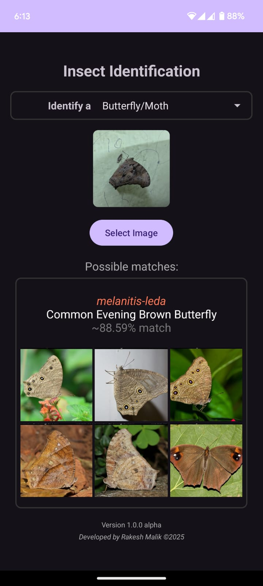
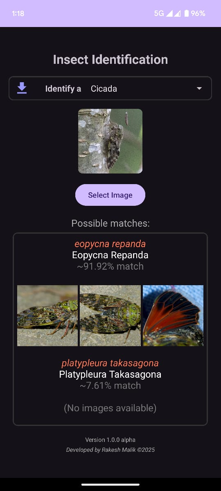

# Insect Species Identification

## Model checkpoints

https://drive.google.com/drive/folders/1FtGjLJc_JNwLs0cey3euyzUxwpids10G?usp=drive_link

## Datasets

https://drive.google.com/drive/folders/10qLVcGkJlLplKjIluRc9GEyQhcqpyhhD?usp=drive_link

| Source					| Image count | Class count | Imago class | Early stage class | Species type   | Region   | Comments
|---------------------------|-------------|-------------|-------------|-------------------|----------------|----------|------------------------------------
| mothsofindia.org   		| 44k         | 3364        | 3060        | 304               | moth           | india    | Contains 411 spp. classes
| ifoundbutterflies.org   	| 66k         | 1554        | 1125        | 429               | butterfly      | india    | Contains 35 spp. classes
| indianodonata.org			| 13k         | 737         | 510         | 200               | odonata        | india    | Contains 27 spp. classes  & 157 empty classes
| indiancicada.org		   	| 1k          | 308         | 308         | 7                 | cicada         | india    | Contains 1 spp. classes  & 139 empty classes
| inaturalist.org           | 232k        | 4221        | 3773        | 448               | all            | india    | Contains  2732 moth,  976 butterfly,  370 odonata,  154 cicada classes
| indiabiodiversity.org   	| 12k         | 1444        | 1444        | 0                 | moth+butterfly | india    | Contains typo in class names,  uses legacy class names
| insecta.pro               | 25k         | 5068        | 5068        | 0                 | moth+butterfly | all      | Low res images (320x~250)
| wikipedia.org				| 2k          | 1825        | 1825        | 0                 | moth+butterfly | india    | Low res images (220x~160)
- early stage classes suffixed with "-early"
- spp. classes suffixed with "-spp" or "-genera" or "-genera-spp"

## Android app

Apk: https://drive.google.com/drive/folders/1UNogisKp3rtcOnigcibAPiNsQB-gZJpD?usp=drive_link

	
	
	

	
	
	

