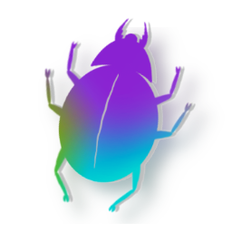
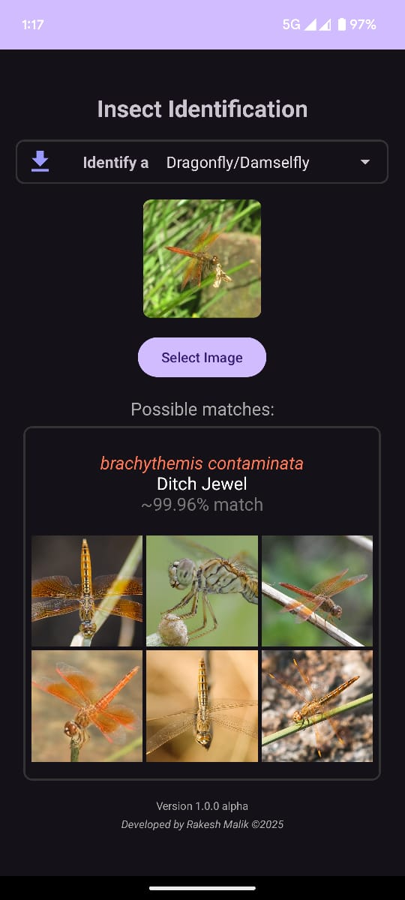
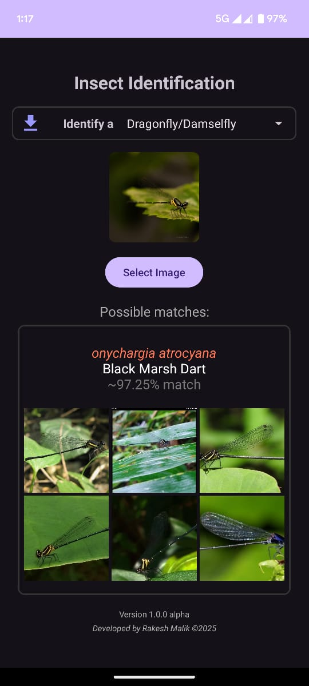

# Insect Species Identification

This open source project aims to train ML models and develop apps to identify insect species from images.

## Android app APK

<!--  -->

Currently trained on 378k images of a total of 4767 Butterflies, Moths, Dragonflies, Damselflies & Cicada species.

[Google Play Store](https://play.google.com/store/apps/details?id=com.rakeshmalik.insectid)

[APK files archive](https://drive.google.com/drive/folders/1UNogisKp3rtcOnigcibAPiNsQB-gZJpD?usp=drive_link)

## Android app screenshots

<p align="center">
	
	
	
	
	
	
</p>

## Android app dependencies

- [OpenCV 4.11.0](https://github.com/opencv/opencv/releases/tag/4.11.0) (location: insect-id-app/opencv)

## List of species and classes trained on

[All species](https://github.com/rakeshmalik91/insect-id/blob/main/species.json) (contains species that do not have any images available as well)

- [Lepidoptera classes](https://github.com/rakeshmalik91/insect-id/blob/main/models/classes.lepidoptera.json)
	- [Butterfly classes](https://github.com/rakeshmalik91/insect-id/blob/main/models/classes.butterfly.json)
	- [Moth classes](https://github.com/rakeshmalik91/insect-id/blob/main/models/classes.moth.json)
- [Odonata (Dragonfly/Damselfly) classes](https://github.com/rakeshmalik91/insect-id/blob/main/models/classes.odonata.json)
- [Cicada classes](https://github.com/rakeshmalik91/insect-id/blob/main/models/classes.cicada.json)

Note: early stage classes suffixed with "-early"

Note: spp. classes suffixed with "-spp" or "-genera" or "-genera-spp"

## Model checkpoints

[Model checkpoints](https://drive.google.com/drive/folders/1FtGjLJc_JNwLs0cey3euyzUxwpids10G?usp=drive_link)

## Datasets trained on

[Datasets](https://drive.google.com/drive/folders/10qLVcGkJlLplKjIluRc9GEyQhcqpyhhD?usp=drive_link)

| Source				            	| Image count | Class count | Imago class | Early stage class | Species groups | Region   | Comments
|---------------------------------------|-------------|-------------|-------------|-------------------|----------------|----------|------------------------------------
| https://www.mothsofindia.org   		| 44k         | 3364        | 3060        | 304               | moth           | india    | Contains 411 spp. classes
| https://www.ifoundbutterflies.org   	| 66k         | 1554        | 1125        | 429               | butterfly      | india    | Contains 35 spp. classes
| https://www.indianodonata.org			| 13k         | 737         | 510         | 200               | odonata        | india    | Contains 27 spp. classes <br/>& 157 empty classes
| https://www.indiancicadas.org		   	| 1k          | 308         | 308         | 7                 | cicada         | india    | Contains 1 spp. classes <br/>& 139 empty classes
| https://www.inaturalist.org           | 232k        | 4221        | 3773        | 448               | all            | india    | Contains <br/>2732 moth, <br/>976 butterfly, <br/>370 odonata, <br/>154 cicada classes
| https://indiabiodiversity.org		   	| 12k         | 1444        | 1444        | 0                 | moth+butterfly | india    | Contains typo in class names, <br/>uses legacy class names
| https://insecta.pro	                | 25k         | 5068        | 5068        | 0                 | moth+butterfly | all      | Low res images (320x~250)
| https://www.wikipedia.org				| 2k          | 1825        | 1825        | 0                 | moth+butterfly | india    | Low res images (220x~160)


## Using mynnlib & the models

#### Prerequisites:
```
python -m pip install --upgrade pip setuptools wheel
pip install pandas seaborn
pip install scikit-learn
pip install pillow
pip install tensorflow
pip install torch torchvision torchaudio --index-url https://download.pytorch.org/whl/cu118
```

`torch.cuda.is_available()` must return `True`

```
pip install matplotlib
pip install opencv-python
pip install python-Levenshtein
pip install imagehash
```

Note: Refer `prerequisites.ipynb` for more details

#### Import library:
```
import mynnlib
from mynnlib import *
```

#### Run prediction on an image:
```
model_data = torch.load("path-to-model-checkpoint.pth", weights_only=False)
prediction = predict("path-to-image.jpg", model_data)
```

#### Run top 5 prediction on an image:
```
model_data = torch.load("path-to-model-checkpoint.pth", weights_only=False)
prediction = predict_top_k("path-to-image.jpg", model_data, 5)
```

#### Train a new model:
```
model_data = init_model_for_training("path-to-train-data-dir", "path-to-val-data-dir", batch_size=32, arch="resnet152", image_size=224, robustness=0.2, lr=1e-4, weight_decay=1e-4, silent=False)
num_epochs = 5
train(model_data, num_epochs, "path-to-output-model-checkpoint-ep###.pth", -0.01)
```

#### Retrain an existing model:
```
model_data = torch.load("path-to-model-checkpoint.pth", weights_only=False)
model_data = prepare_for_retraining(model_data, "path-to-train-data-dir", "path-to-val-data-dir", batch_size=32, image_size=224, robustness=0.2, silent=False)
num_epochs = 5
train(model_data, num_epochs, "path-to-output-model-checkpoint-ep###.pth", -0.01)
```

## Using mynnlibv2 (Supports incremental training)

#### Import library:
```
import mynnlibv2
from mynnlibv2 import *
```

#### Train a new model:
```
init_model(f"{dataset_dir}/data", f"{dataset_dir}/val", batch_size=32, image_size=224, lr=1e-4, validate=False)
for epoch in range(15):
    result = run_epoch(model_data, output_path=f"{dataset_dir}/checkpoint.inc.lepidoptera.ta", robustness_lambda=0.1)
```

#### Retrain existing model with a new data:
```
model_data = torch.load("path-to-model-checkpoint.pth", weights_only=False)
model_data = init_iteration(model_data, f"{dataset_dir}/i01-train", f"{dataset_dir}/i01-val", lr=1e-4)
for epoch in range(5):
    result = run_epoch(model_data, output_path=f"{dataset_dir}/checkpoint.inc.lepidoptera.ta", robustness_lambda=0.1)
```

# Backlog

- Cover other species groups
- Complete existing incomplete species groups
- Graceful handling of Larvae, Pupae, Imago, Eggs, Cocoon etc.
- Fine tune incremental training and explore other architectures
- Fine tune data for common issues
	- Typo in species names
	- Resolve existance of same species with different names (e.g. nepita-conferta / asura-conferta)
- App backlog
	- Fine tune image preprocessing for screen capture and other common issues
	- Move models from Google Drive to better alternative, as it may have rate limit or other issues
	- Settings in app to properly control models download/update
	- Run through Root-classifier model and multiple models to identify unknown species group images

| Species Groups			| Estimated species count in India | Species covered 
|---------------------------|----------------------------------|---------------------
| Lepidoptera > Moth		| 12000+                           | 2899           
| Lepidoptera > Butterfly	| 1300+                            | 1501           
| Odonata					| 760+                             | 510           
| Hemiptera > Cicada		| 250+                             | 300     


# Related Issues/Blogs

- [libc++_shared.so conflicts on Android project when using PyTorch and OpenCV](https://medium.com/@ghostknife/libc-shared-so-conflicts-on-android-project-when-using-pytorch-and-opencv-811abb6322e6)

