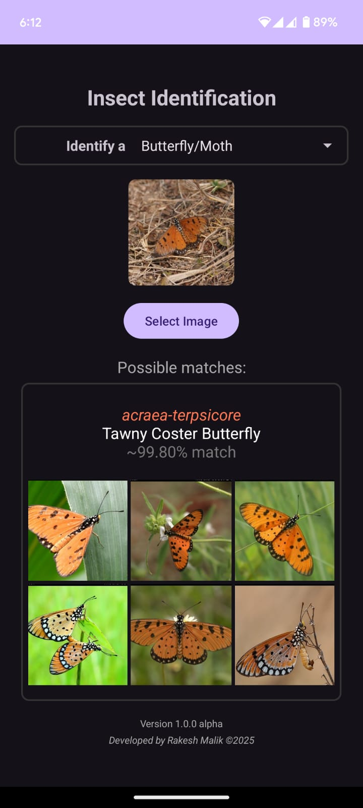

# Insect Species Identification

<div align="center">
	
	<br/>
	<b>AI-Powered Identification for Indian Insects</b>
</div>

<br/>

**InsectID** is an open-source project combining deep learning and mobile technology to identify insect species from images. With a focus on **Indian** biodiversity, the system is currently trained to recognize thousands of species including **butterflies, moths, dragonflies, and cicadas**.

> ⚠️ **Note**: This project is currently in an **early prototype stage**. Mechanics, visuals, and features are subject to change and improvement.
>
> 🛑 **Disclaimer**: This project is developed for **educational purposes and personal use only**.

## 📱 Mobile App (Android)

Identify insects on the go with the Android application.

- **[Google Play Store](https://play.google.com/store/apps/details?id=com.rakeshmalik.insectid)** (Latest Beta)
- **APK Archives**: [Google Drive](https://drive.google.com/drive/folders/1UNogisKp3rtcOnigcibAPiNsQB-gZJpD?usp=drive_link) | [Dropbox](https://www.dropbox.com/scl/fo/5t1zgkn419ctlzkuacu3h/ACC-_MbfOOu151yPRRH25XU?rlkey=3tirqkq5xland2qx3dfa8hrda&st=0aosjy2b&dl=0)

<p align="center">
	
	
	
	
	
</p>

## 🚀 How to Use

1. **Launch the App**: Open InsectID on your Android device.
2. **Manage Models**:
   - Before identifying, ensure you download the relevant model for your insect type.
   - Available Models: **Butterfly & Moth**, **Dragonfly & Damselfly**, **Cicada**.
   - *Note: Models require internet to download once, but identification works **completely offline** afterwards.*
3. **Choose Input Method**:
   - 📷 **Camera**: Point your camera at an insect to capture a photo.
   - 🖼️ **Gallery**: Select an existing image from your photo library.
4. **Crop & Focus**: For best results, crop the image so the insect fills most of the frame.
5. **Select Model & Identify**: Choose the correct model group from the dropdown/menu and tap the checkmark to analyze.
6. **Results**: The AI will list the most likely species matches with confidence scores.

## 🧠 Model & Data Statistics

The current model is trained on **378k+ images** covering **4,767 unique species/classes**.

| Species Group | Covered (Count) | Estimated (India) |
| :--- | :--- | :--- |
| **Moths** (Lepidoptera) | 2,899 | 12,000+ |
| **Butterflies** (Lepidoptera) | 1,501 | 1,300+ |
| **Dragonflies/Damselflies** (Odonata) | 510 | 760+ |
| **Cicadas** (Hemiptera) | 300 | 250+ |

### Dataset Sources
| Source | Images | Classes | Region | Notes |
| :--- | :--- | :--- | :--- | :--- |
| [Moths of India](https://www.mothsofindia.org) | 44k | 3,364 | India | Primary source for moths |
| [Butterflies of India](https://www.ifoundbutterflies.org) | 66k | 1,554 | India | High quality verified images |
| [Indian Odonata](https://www.indianodonata.org) | 13k | 737 | India | Includes empty classes |
| [Indian Cicadas](https://www.indiancicadas.org) | 1k | 308 | India | Sparse data |
| [iNaturalist](https://www.inaturalist.org) | 232k | 4,221 | India | Large volume, mixed quality |
| [India Biodiversity](https://indiabiodiversity.org) | 12k | 1,444 | India | Legacy names, some typos |
| [Insecta.pro](https://insecta.pro) | 25k | 5,068 | Global | Low res images |
| [Wikipedia](https://www.wikipedia.org) | 2k | 1,825 | India | Reference only |

**Model Checkpoints**: [Google Drive](https://drive.google.com/drive/folders/1FtGjLJc_JNwLs0cey3euyzUxwpids10G?usp=drive_link)
**Raw Datasets**: [Google Drive](https://drive.google.com/drive/folders/10qLVcGkJlLplKjIluRc9GEyQhcqpyhhD?usp=drive_link)

## 🛠️ Python Library Usage (`mynnlib`)

The project includes custom wrapper libraries `mynnlib` and `mynnlibv2` for easy training and inference.

### Installation
Ensure you have `torch` (with CUDA support if available) and other dependencies installed.

```bash
pip install -r requirements.txt
```

*Note: The `requirements.txt` includes an extra index URL for PyTorch with CUDA 11.8 support. Adjust if necessary for your system.*

### Inference Example
```python
import mynnlib
from mynnlib import predict, predict_top_k

# Load Model
model_data = torch.load("path/to/checkpoint.pth", weights_only=False)

# Single Prediction
result = predict("image.jpg", model_data)
print(f"Species: {result}")

# Top-5 Predictions
top5 = predict_top_k("image.jpg", model_data, 5)
print(top5)
```

### Training Example (Incremental)
Use `mynnlibv2` for incremental learning capabilities.

```python
import mynnlibv2
from mynnlibv2 import init_model, run_epoch

# Initialize New Model
model_data = init_model(
    train_dir="dataset/data",
    val_dir="dataset/val",
    batch_size=32,
    image_size=224,
    lr=1e-4
)

# Train Loop
for epoch in range(15):
    run_epoch(model_data, output_path="checkpoints/model", robustness_lambda=0.1)
```

## 🗓️ Backlog & Roadmap
- [ ] **Species Expansion**: Cover Beeltes, Hymenoptera (Bees/Wasps), and Orthoptera.
- [ ] **Lifecycle Handling**: Better classification for Larvae, Pupae, and Eggs.
- [ ] **App Improvements**:
    - Better screen capture handling.
    - User-controlled model downloading (move away from Google Drive).
- [ ] **Data Cleanup**: Resolve taxonomic synonyms and typos in source data.
- [ ] **Root Classifier**: Hierarchical model to first identify Order/Family before Species.

## 📚 Related Resources
- **Blog**: [Fixing libc++_shared.so conflicts on Android with PyTorch/OpenCV](https://medium.com/@ghostknife/libc-shared-so-conflicts-on-android-project-when-using-pytorch-and-opencv-811abb6322e6)
- **Issue**: [KB pagination support for PyTorch Lite](https://github.com/pytorch/pytorch/issues/154449)
